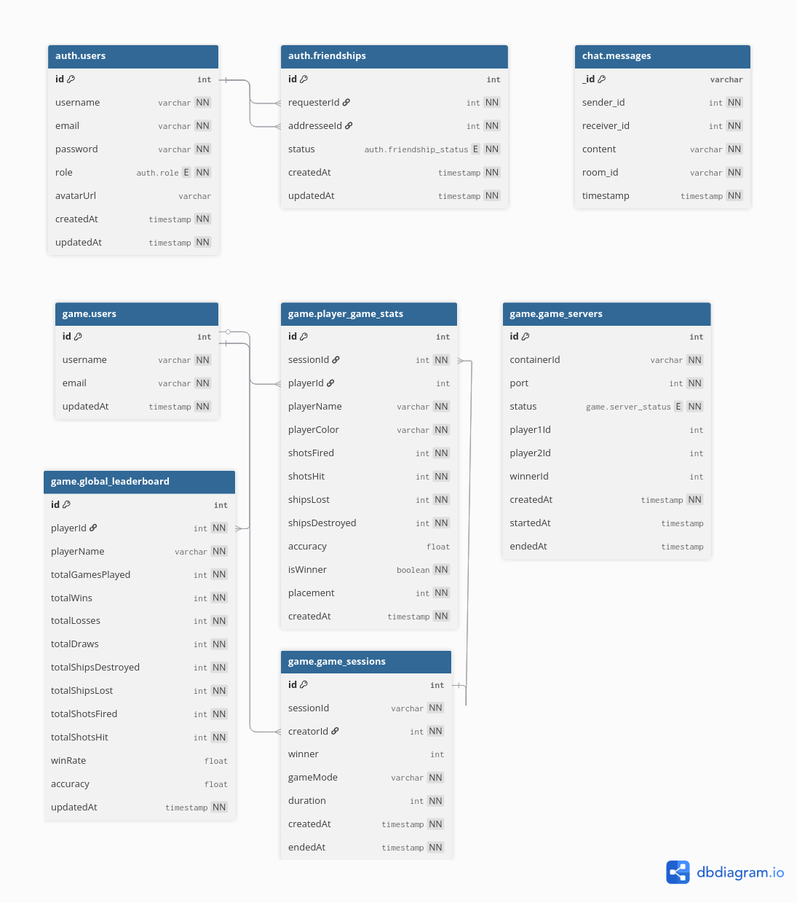

# Space-Supremacy

This project has been created as part of the 42 curriculum by **kforfoli**, **pmolzer**, **jkrumm**, **stdi-pum** & **ahugi**.

## Description

Space-Supremacy is a web-based game application where players shoot at each other, based on the Space Invader classic. It features a chat, game stats, and a friends system. The AI opponent was trained with machine learning, based on DQN. The application uses a micro-services architecture, and secrets and keys are secured using HashiCorp Vault. We used Coraza as the WAF.

## Instructions

The game is hosted online at [http://spacesupremacy.duckdns.org](http://spacesupremacy.duckdns.org). To start playing, you must first register, then start a new game against another player on the same machine, against an AI, or both.

### Running Locally

1. Copy the `example.env` file into a `.env` file.
4. Run `start.sh` in the root of the repository.
5. Access `localhost` on port `443`.

## Technical Stack

### Frontend

- TypeScript + React + Next.js + Phaser

### Backend

- React + Next.js

### Databases

- **PostgreSQL + Prisma (ORM)** — Common DB used with Next.js, industry standard
- **MongoDB + Mongoose (ORM)** — Easy to implement

### Video Game

- Class-based object-oriented architecture in JavaScript

### AI Bot

- PyTorch (`torch`, `torch.nn`, `torch.nn.functional`) for RL model/training
- `python-socketio` AsyncClient for asynchronous Socket.IO communication

### Other Significant Technologies & Libraries

| Library | Purpose |
|---|---|
| Axios | HTTP client for API requests |
| Next-auth | Authentication and session management |
| Bcryptjs | Hashing passwords |
| Jsonwebtoken | Create and verify JWT for session management and security |
| TailwindCSS | UI/Design |
| Socket.IO 4 | WebSocket server for real-time communication |
| Socket.IO Client | Browser-side socket connection (e.g. `ChatInterface.tsx`) |

### Justification for Major Technical Choices

We decided to go with **JWT for session management** to avoid having to make DB checks and make authentication smoother for users. Since we have a micro-service architecture, and the chat and game services need to check if the user is authenticated, they can do it independently by checking with the local `AUTH_SECRET` env. There is no session DB. The downside is that the tokens have a time window of validity (1 day in our case), so tokens can be reused while within that window. If the token is stolen, it can also be used, although we have some security against this via the options `httponly: true` and `secure: true` (HTTPS only).

## Database Schema

This project runs two databases:

- **PostgreSQL** for the auth service and the game service
- **MongoDB** for the chat service

### Auth Service

The `users` table is the center of the whole system. It stores credentials & roles. A separate `friendships` table tracks the friendships between users with a status field covering the full lifecycle: a request starts as `PENDING`, becomes `ACCEPTED` if the other user confirms, or `BLOCKED` if they don't want contact. `requesterId` and `addresseeId` are connected to avoid duplicated requests between two users.

### Game Service

- `game_servers` tracks the Docker containers that actually run games: one row per container, with ports and player slots.
- `game_sessions` records completed games, supporting 1-to-4 player modes.
- `player_game_stats` stores each player's individual performance: shots fired, accuracy, placement. The `playerId` field is nullable, which lets the system record stats for AI opponents and anonymous local players without needing a real account.
- `global_leaderboard` is denormalized. Rather than aggregating `player_game_stats` on every leaderboard request, totals are written there directly when a game ends. This makes fetching leaderboard stats much faster.

### Chat Service

- **server.ts**: Custom server that creates an HTTP server, attaches Next.js and Socket.IO to it, and exposes `io` globally for API routes to use.
- **socketHandler.ts**: Uses middleware that forwards the client's JWT to `auth_srvc/api/auth/verify` before allowing any connection.
- **Room management**: On connect, users join a personal room and DM rooms. The handler validates that the user's ID is part of the room ID before allowing the join.
- **Message model**: Mongoose schema with `sender_id`, `receiver_id`, `content`, `room_id`, `timestamp`, and a compound index on `(room_id, timestamp)`.
- **Send route (API)**: `POST /api/chat/send` authenticates, validates, persists to MongoDB, then broadcasts via `io.to(room_id).emit('receive_message')`.
- **History route (API)**: `GET /api/chat/history` fetches messages by `room_id` with cursor-based pagination.
- **page.tsx**: Authenticates via `auth_srvc` session/token endpoints, loads the friends list, renders a friend grid, and mounts `ChatInterface` for the selected friend.
- **chatinterface.tsx**: Single socket per session (recreated only on token change, not on friend switch). Room switching emits leave/join without reconnecting.

Messages live in MongoDB. Each message belongs to a room, and room IDs are generated by sorting two user IDs and joining them with an underscore so a conversation between users 42 and 17 always maps to `17_42`, regardless of who sends first. There is no room table — the room ID is computed, not stored.

## Features

| Feature | Owner(s) |
|---|---|
| Registration and Authentication | Antoine |
| Session management with JWT | Antoine |
| User management (avatar, username, stats) | Antoine |
| Friendships (send, accept, block) | Antoine |
| Chat with persistent history | Kyriaki |
| AI opponent (ML-trained) | Stefano |
| Multiplayer (PvP, PvAI, or both) | Stefano & Peter |
| Game history and player stats | Stefano & Antoine |
| Secrets protection (HashiCorp Vault) | Johannes |
| WAF (Coraza + CRS on NGINX) | Johannes |
| Hidden Service | Johannes |

## Modules

### Major (2 pts): Use a framework for both the frontend and backend
- **All team members**
- **Justification**: Frameworks help with using industry conventions, have useful built-in features that we don't need to rebuild ourselves, and make it easier to work with multiple devs on the same base.

### Major (2 pts): Standard user management and authentication
- **Antoine**
- **Justification**: We wanted to make users a bit more personable, especially since they can chat and play together, and that they can add friends to play together again.
- **Implementation**: Next.js was used for the authentication, using JWT to store sessions and allow the other services to easily check if the user making requests is authenticated or not. The user/auth service has its own database to store all the information related to users, as well as friendships, which is called by the other services as needed.

### Minor (1 pt): Use an ORM for the database
- **Peter**
- **Justification**: We wanted to simplify the way we interact with our PostgreSQL database, and avoid writing raw SQL.
- **Implementation**: We used Prisma as our ORM. In Prisma, we define our database structure in a schema file, and Prisma generates a client that we can use directly in our TypeScript code. Prisma also provides migrations, which let us version and apply database schema changes in a controlled way. This made development faster, improved maintainability, and reduced the risk of SQL-related mistakes.

### Major (2 pts): Implement real-time features using WebSockets or similar technology
- **Peter, Kyriaki**
- **Justification**: Our project needed live interaction between multiple clients, especially for chat and gameplay. Traditional request-response HTTP would not be enough, because users need to see updates immediately without refreshing the page.
- **Implementation**: We used Socket.IO, which builds on WebSocket-style real-time communication. In the chat service, authenticated users connect through sockets, join specific rooms, and receive targeted updates. In the game service, the server is authoritative and continuously broadcasts the current world state to connected players. We also handle connection and disconnection properly by validating users on connect, assigning them to rooms or slots, and cleaning up their state when they leave. For efficiency, we do not broadcast everything to everyone blindly: we use rooms, scoped events, and controlled snapshot frequency to reduce unnecessary traffic.

### Major (2 pts): Allow users to interact with other users (chat, profile, friends)
- **Kyriaki, Antoine**
- **Justification**: Since the users can play against each other, it's nice to have the option to keep friends and chat with them, so you can play against them again.
- **Implementation**: The Friends system manages requests with 3 states: Pending, Accepted, and Blocked. Since there is a constraint in the database between the requester and requestee IDs, requests can't be duplicated. The profile page allows users to send and manage friend requests, see their personal stats, and manage their personal data. The chat service is a Next.js app with a custom server that bolts Socket.IO onto the same HTTP process, allowing for real-time messaging between friends. Messages persist using MongoDB and are delivered via sockets in rooms, where each DM gets a `room_id` derived from the two user IDs. All authentication is delegated to the `auth_srvc` for verification via API routes and socket connections that forward the user's JWT to it. The frontend presents a cyberpunk-themed UI where users pick a friend from a grid and exchange messages that are server-authoritatively broadcasted.

### Minor (1 pt): Game statistics and match history
- **Stefano, Antoine**
- **Justification**: Given we already save game statistics after each game, and we have a user profile, why not also add the history to their profile.
- **Implementation**: The user profile page on the frontend makes an API call to a specific endpoint in the `game_service`, requesting the game stats of a specific user, and then displays the entries for that user.

### Major (2 pts): Introduce an AI Opponent for games
- **Stefano**
- **Justification**: We wanted to experience the Machine Learning technology and have an autonomous bot which does not follow hardcoded rules but rather learns from experience.
- **Implementation**: Multi-head MLP DQN (multi-discrete action space) is at the base of our ML. It learns through a prevision-reward applied to state–action pairs using a deep neural network.

### Major (2 pts): Implement WAF/ModSecurity (hardened) + HashiCorp Vault for secrets
- **Johannes**
- **Justification**: Security is underrated.
- **Implementation**: Coraza WAF hardened with CRS on NGINX, Vault using client certificates for initial trust, setting up PKI, KV2 and Database endpoints with custom password and username policies. Segmentation of networking and HTTPS everywhere with client verification. Passing POSIX shellscript to each service as entrypoint to automatically retrieve secrets.

### Minor (1 pt): Module of choice: Hidden Service
- **Johannes**
- **Justification**: Beeing able to test online features and not having issues with localhost while relying on other services.
- **Implementation**: Custom Docker image based on alpine, vanity v3 addresses and advertisement via Onion-Location header.

### Major (2 pts): Implement a complete web-based game
- **Stefano**
- **Justification**: We wanted to increase the fun: as an action game, challenging real people is more engaging.
- **Implementation**: The goal of the game is to destroy the challenger fleet and detain supremacy over the Universe! We have different gaming modes to choose how many fleets will be fighting. If you are alone you can play against bots, but otherwise you can challenge your friends, locally or remote. The game is class-based object-oriented architecture in JavaScript.

### Major (2 pts): Remote players
- **Peter**
- **Justification**: Adding the ability to connect players remotely enhances our project and makes it ready for a real-life scenario in which a game can be played remotely by multiple players.
- **Implementation**: We set up a VPS on GCloud which offers a generous free-tier, giving a free server for low traffic use. Its network has low latency to users and runs on standard Ubuntu, so the full Docker+Nginx stack transfers directly from local dev without major changes. For DNS we used DuckDNS which offers free dynamic DNS services, mapping a human-readable hostname to the public IP of the VPS.

### Major (2 pts): Multiplayer game (more than two players)
- **Peter & Stefano**
- **Justification**: The more the merrier.
- **Implementation**: We implemented the multiplayer module to support up tp 4 simultaneous players in the same game session. The server owns the authoritative game state, which keeps movement, scoring, collisions, and outcomes fair for every participant. Clients send actions to the server and receive synchronized state updates, so all players see the same match progression. This design prevents one client from controlling the truth and keeps gameplay consistent across everyone’s screen.

## Project Management

### Team Roles

| Role | Member | Responsibilities |
|---|---|---|
| **PO** | ahugi | User service, organized feature selection, README |
| **PM** | pmolzer | CI/CD, formatting rules, ORM and WebSockets, arranging meetings |
| **Tech Lead** | kforfoli | Chat service and associated features, setting up Docker |
| **Developer** | jkrumm | Cybersecurity and Secret Management |
| **Developer** | stdi-pum | Game service, ML training of AI bot |

### Task Distribution

Based on modules as well as respective service (User, Social, Game).

### Meetings

Weekly meetings to discuss past week results and current week plans, as well as any blockers or general discussion on tech, direction, etc.

### Communication

- **Channel**: Slack
- **Tools**: GitHub Issues

## Individual Contributions

- **Johannes** — Networking and Security
- **Peter** — ORM and WebSockets
- **Kyriaki** — Chat feature and WebSockets
- **Stefano** — Game and AI features (training, game implementation)
- **Antoine** — Authentication, some of the social features, and DB schemas

## AI Usage

AI was used extensively in this project for generating boilerplate code and fixing bugs (with Claude Code), as well as reviewing commits and pull requests (with Code Rabbit). It was also used throughout to discuss the tech setup, alternative options, and weighing pros and cons of the solutions used. AI was not used for security related code.

## Resources

- [ESLint rules for TypeScript](https://typescript-eslint.io/rules/)
- [Prisma with Next.js](https://www.prisma.io/docs/guides/nextjs)
- [Next.js + Prisma + Postgres (Vercel)](https://vercel.com/kb/guide/nextjs-prisma-postgres)
- [Next.js `use client` directive](https://nextjs.org/docs/app/api-reference/directives/use-client)
- [React form submission](https://www.w3schools.com/react/react_forms_submit.asp)
- [JWT Introduction](https://www.jwt.io/introduction#what-is-json-web-token)
- [NextAuth.js](https://next-auth.js.org/getting-started/introduction)
- [React + TypeScript forms & events cheatsheet](https://react-typescript-cheatsheet.netlify.app/docs/basic/getting-started/forms_and_events/)
- [Sign-up form in React with TypeScript](https://dev.to/luqmanshaban/creating-a-sign-up-form-in-react-with-typescript-2jb3)
- [Socket.IO v4 docs](https://socket.io/docs/v4/)
- [concurrently (npm)](https://www.npmjs.com/package/concurrently)
- [Socket.IO v3 server initialization](https://socket.io/docs/v3/server-initialization/)
- [GCloud Compute — Create instances](https://docs.cloud.google.com/compute/docs/instances/create-start-instance)
- [GCloud locations](https://cloud.google.com/about/locations)
- [GCloud metadata server troubleshooting](https://docs.cloud.google.com/compute/docs/troubleshooting/troubleshoot-metadata-server)
- [GCloud IAM](https://docs.cloud.google.com/compute/docs/access/iam)
- [GitHub Actions — GITHUB_TOKEN permissions](https://docs.github.com/en/actions/tutorials/authenticate-with-github_token#permissions-for-the-github_token)
- [Next.js file-based routing](https://nextjs.org/docs/pages/building-your-application/routing)
- [dbdiagram.io](https://dbdiagram.io/)
- [AI & Machine Learning (Notion)](https://www.notion.so/42wolfsburgberlin/AI-MACHINE-LEARNING-309937251cae80218f37f675b3af3e9d?t=34a937251cae805cb05600a9cdb68bd9)
- [Docker](https://docs.docker.com)
- [YAML Advanced Features](https://yaml.cc)
- [NGINX](https://nginx.org)
- [OWASP Coraza WAF](https://www.coraza.io)
- [CoreRuleSet](https://coreruleset.org/)
- [Hashicorp Vault](https://www.hashicorp.com)
- [Tor](https://www.torproject.org)
- [Stack Overflow](https://stackoverflow.com)
